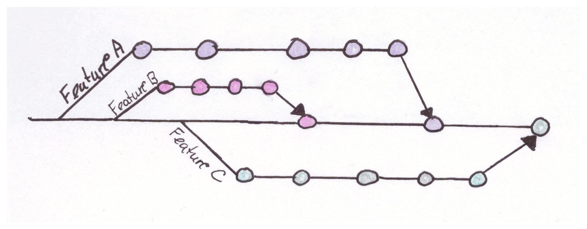
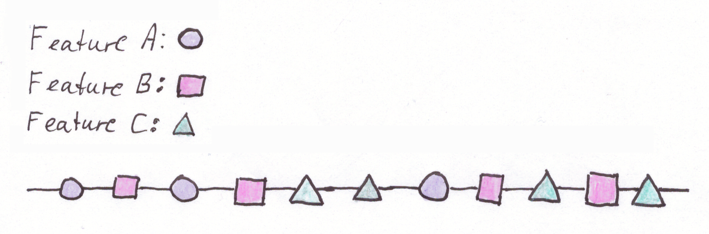
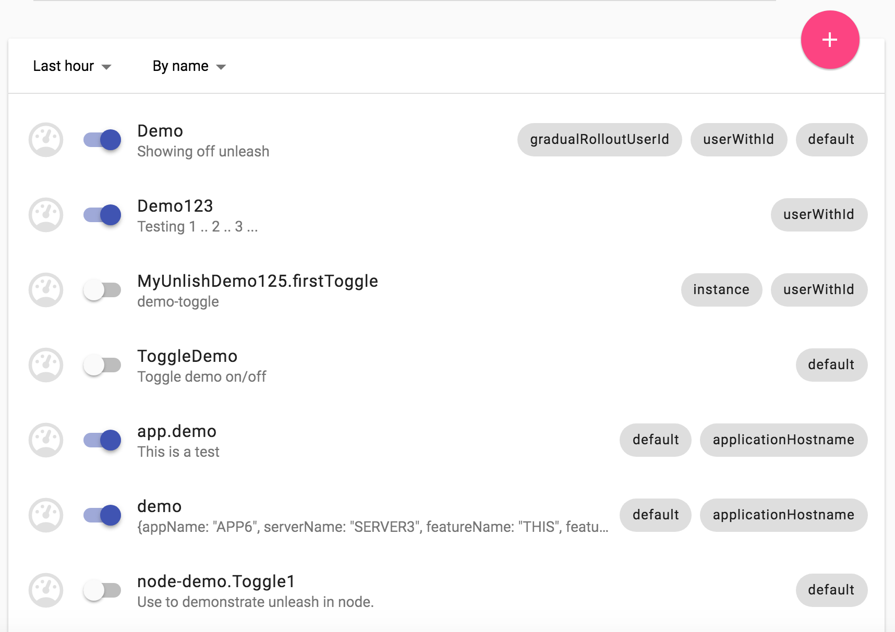
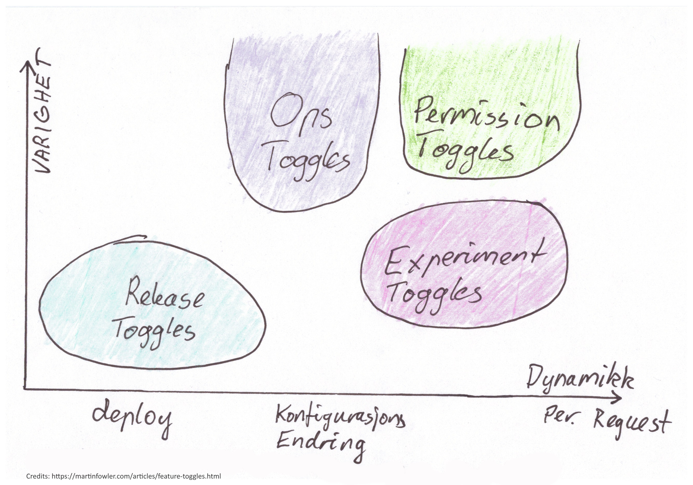
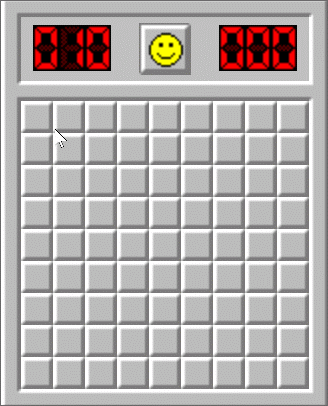
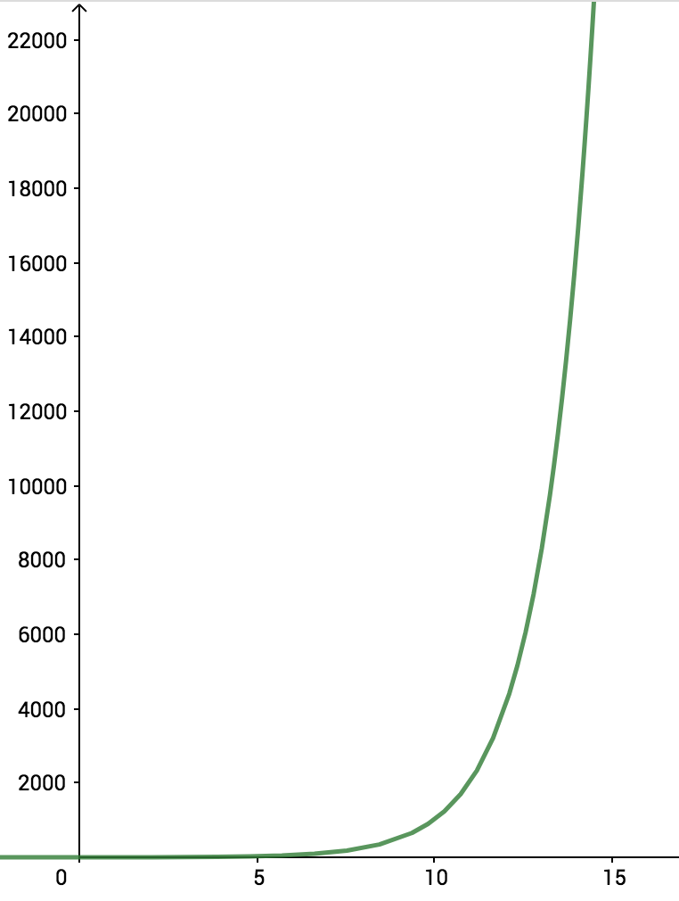

## Feature toggles

Olav Nybø

---

## Hva er en feature toggle?
<br/>

```cs
  if( MyAwesomeNewFeature.IsEnabled ) 
  {
      // Do the new awesome thing
  }
  else
  {
      // Keep doing the old stuff
  }
``` 

---

## Hva bruker vi dem til?

<ul>
    <li>release toggles </li>
    <ul class="subitem"> <li >styre hva som inkluderes i en release</li> </ul>
    <li>experiment toggles</li>
    <ul class="subitem"> <li >teste ut effekten av features</li> </ul>
    <li>ops toggles</li>
    <ul class="subitem"> <li >black friday</li> </ul>
    <ul class="subitem"> <li >gradvis utrulling</li> </ul>
    <li>permission toggles</li>
    <ul class="subitem"> <li >styre tilgang features</li> </ul>
</ul>

---

##### Release toggles - Trunk based development Vs Feature branching



--

## Trunk based development



---

## Konfigurasjon av toggles

- Hardkoding
- Command line
- Konfigurasjonsfil 
- Applikasjons Databasen
- Konfigurasjonssystem (Launchdarkly, Unleash, Consul, Etcd, Zookeeper)
- Overstyre konfigurasjon 

--

## Hardkoding

```console

  const bool EnableFeatureA = true;

  if (EnableFeatureA)
  {
      //do it
  } 
``` 

--

## Command line

```console
  $ my_application.exe --enableFeatureA 
``` 

--

## Konfigurasjonsfil

appsettings.json
```json
  {
    "FeatureToggle": {
        "FeatureA": "true",
        "FeatureB": "false"
    },
  }
``` 

--

## Release toggles
Statisk konfigurasjon - appsettings.json

## Andre toggles
Konfigurasjonssystem

--

## Konfigurasjonssystem (Launchdarkly, Unleash, KV-store)



--

Hva skal jeg bruke da?


It depends <!-- .element: class="fragment current-visible" -->

--



<aside class="notes">
- Uferdig kode som deployes til produksjon
- Ikke testet
- Må ikke aktiveres før den er godkjent
</aside>

--


 

---

## Bruk med måte

<div style="font-size: 40%;"> 
    <span>FeatureA(on/off)</span>
    <span style="font-weight: bold;"> X </span>
    <span>FeatureB(on/off)</span>
    <span style="font-weight: bold;"> X </span>
    <span>FeatureC(on/off)</span>
    <span style="font-weight: bold;"> X </span>
    <span>FeatureD(on/off) ..... </span>
</div>



---

## Teknisk gjeld
 

Rydding av gamle toggles blir en kontinuerlig prosess

---

## Oppsummering

- Et av flere verktøy for å kunne gjøre kontinuerligleveranse med Trunk based development
- Muliggjør frikobling av deploy og aktivering av features
- Ingen silver bullet

